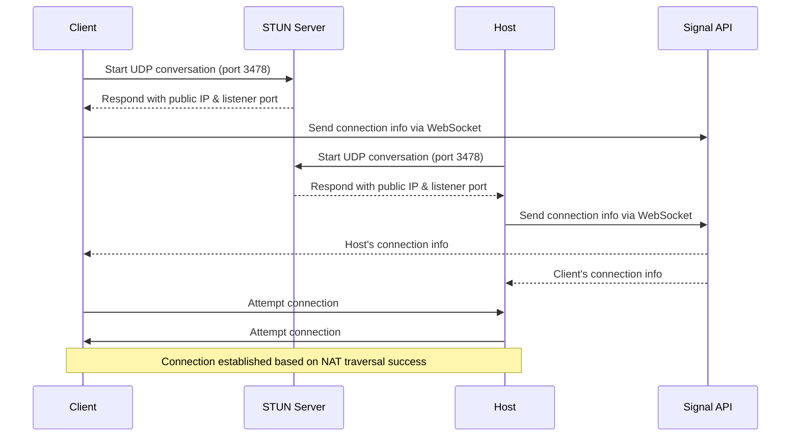
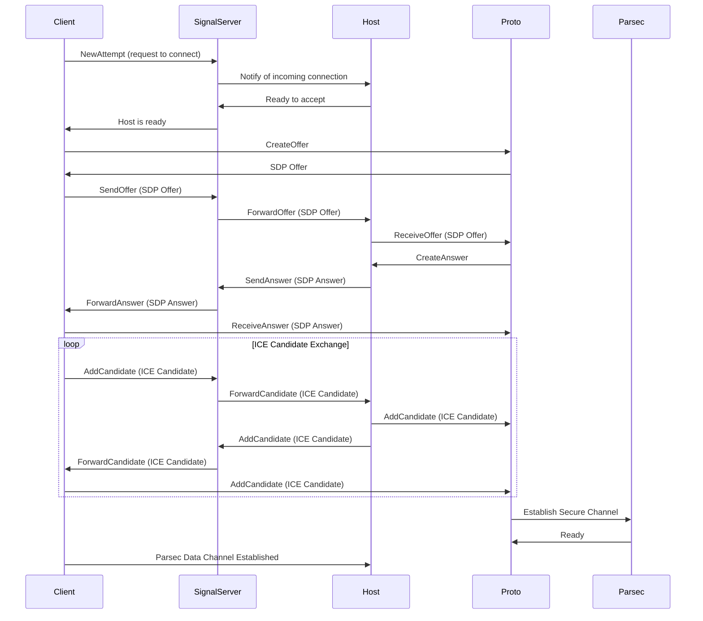

 

    
    <h1 align="center">libparsec</h1>
    
⚡ The imaginary Parsec SDK Low latency, peer-to-peer, interactive game streaming.

 

## 🚧 Working in progress

The goal is single header for C/C++, and Rust bindings. Output binaries would be static lib and dynamic lib (DLL).

> F**k this $320M acquisition!

### Target platforms

- [x] Windows (64-bit)
- [ ] Linux
- [ ] macOS 

### Client features

- [x] Hardware decoders
- [x] FFmpeg decoder (smaller build)
- [x] HEVC codec 
- [x] YUV420, YUV444
- [x] 10-bit color

### Instance functions

- [x] ParsecInit
- [x] ParsecDestroy
- [x] ParsecGetConfig
- [x] ParsecGetBuffer
- [x] ParsecFree
- [x] ParsecSetLogCallback
- [x] ParsecVersion
- [x] ParsecGetOutputs
- [ ] ParsecGetAudioOutputs
- [x] ParsecGetDecoders
- [x] ParsecJSONCommand
- [x] ParsecCanHost
- [ ] ~~ParsecGetVUSBState~~ (not supported)
- [ ] ~~ParsecGetVDDState~~ (not supported)
- [ ] ParsecSetConfig

### Client functions

- [x] ParsecClientConnect (removed in new SDK)
- [x] ParsecClientDisconnect
- [x] ParsecClientGetStatus
- [x] ParsecClientGetGuests
- [x] ParsecClientSetConfig
- [x] ParsecClientSetDimensions
- [x] ParsecClientPollFrame
- [x] ParsecClientPollAudio
- [x] ParsecClientPollEvents
- [ ] ~~ParsecClientGLDestroy~~ (deprecated)
- [x] ParsecClientSendMessage
- [x] ParsecClientPause
- [x] ParsecClientEnableStream
- [x] ParsecClientSendUserData
- [x] ParsecClientSendExtraData
- [ ] ~~ParsecClientScalePenMessage~~ (not supported)
- [ ] ~~ParsecClientSendVirtualUSB~~ (not supported)

### Host functions

`HOST_DESKTOP` only.

- [x] ParsecHostStart
- [x] ParsecHostStop
- [x] ParsecHostGetStatus
- [x] ParsecHostSetConfig
- [x] ParsecHostGetGuests
- [x] ParsecHostKickGuest
- [x] ParsecHostSendUserData
- [x] ParsecHostSendUserDataAll
- [x] ParsecHostBeginP2P
- [x] ParsecHostSetPermissions

### Signal functions

[Signal server](https://support.parsec.app/hc/en-us/articles/4423453624077-Components-and-Connection-Sequence) and these functions are used to control the handshake flow. 
This is a way to build your own server without relying on the Parsec's online service.

- [x] ParsecSignalInit
- [x] ParsecSignalDestroy
- [x] ParsecSignalUpdateHost
- [x] ParsecSignalConnect
- [x] ParsecSignalDisconnect
- [x] ParsecSignalSendCandidate
- [x] ParsecClientNewAttempt
- [x] ParsecClientAddCandidate
- [x] ParsecClientBeginP2P
- [x] ParsecClientEndConnection

Signal callbacks:

- [x] ParsecSignalOpenCallback
- [x] ParsecSignalErrorCallback
- [x] ParsecSignalAnswerCallback
- [x] ParsecSignalCandexCallback
- [x] ParsecSignalSdkCallback

### WebRTC client implementation

SCTP is a side protocol of Parsec host implementation that allows WebRTC connection.

The client should meet:
- SCTP-based Data Channels ([RFC8831](https://www.rfc-editor.org/rfc/rfc8831.html))
- DTLS/UDP ([RFC7350](https://www.rfc-editor.org/rfc/rfc7350.html) and [RFC8261](https://www.rfc-editor.org/rfc/rfc8261.html))
- DTLS with ECDSA ([RFC8827](https://www.rfc-editor.org/rfc/rfc8827.html))

